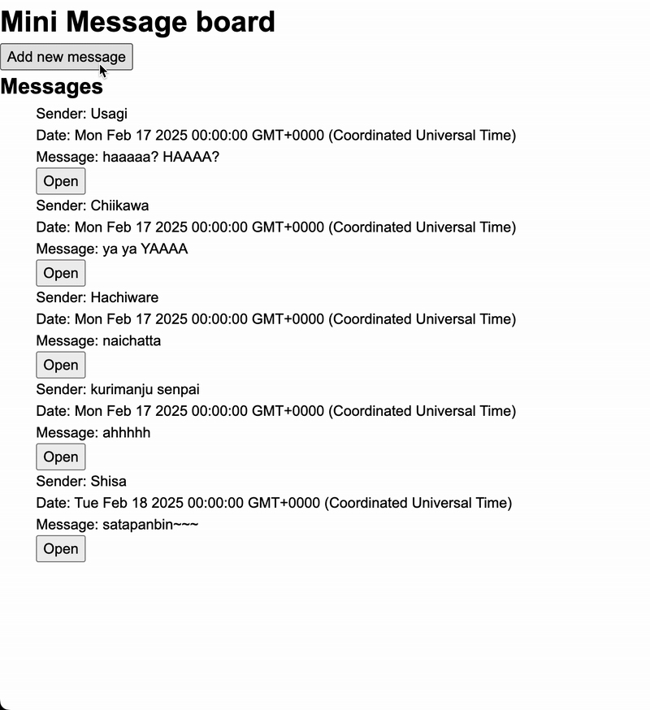

# nodejs-express-template
<h3 align="center">Post a message for everyone to see <a href='https://mini-message-board-production-72f0.up.railway.app/'>here</a>!</h3>

    

### Features
- Post message to a message board
- Supports author, message text, and date posted
- Features routes for 
    - new message page
    - message details page
- Messages stored in deployed PostgreSQL database

### Stack
- NodeJS 
- Express
- EJS
- CSS
- PostgreSQL
- Javascript
- Server and Database hosted on Railway

## Learning Outcomes
- First express project!
- Practicing server setup, routers, MVC, serving static files
- First time deploying a dynamic site!
- First time deploying a remote database!!!! Neato!!!

## Retrospective (aka yapping)
- A basic (and ugly) project used to practice Express for the first time
- Was pretty fun practicing MVC actually. This is the first time I used MVC where I could actually feel it's usefulness (because I rarely did backend in the past haha)
- Connecting an external database was kinda neat! I feel very full stack 8)